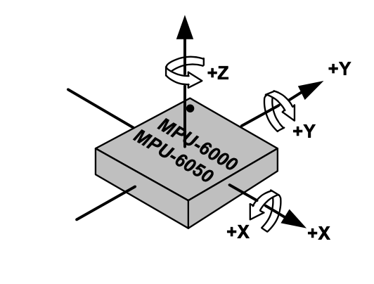

# Gyro Orientation

The flight controller must view the world from the same orientation that you do.
If orientation of the IMU in your aircraft does not match the way you are viewing the aircraft orientation there will be problems.
Gyro rotations and attitude angles will be incorrect and the aircraft will not be able to fly.
Instead of simply changing the orientation of the IMU inside your aircraft we can "rotate" the IMU in software.

After the `Madgwick6DOF()` debug the `attitude_euler`.
You will do so like this.
```
bool should_print = shouldPrint(current_time, 10.0f); // Print data at 50hz

if (should_print) {
  printDebug("attitude roll", attitude_euler[AXIS_ROLL]);
  printDebug(", pitch", attitude_euler[AXIS_PITCH]);
  printDebug(", yaw", attitude_euler[AXIS_YAW]);
  printNewLine();
}
```
You should then verify that rolling the aircraft to the right increases attitude roll,
that pitching nose down increases attitude pitch,
and that yaw left increases that attitude yaw.
Yes I know that yaw seems backwards here, that is ok we can handle this in other parts of the code.

This image of the MPU-6000/MPU-6050 is how the gyro orientation works with +X pointing to the front of the aircraft.



If your rotation does not match you must go to `global_defines.h` and change the `axisRotation imuRotation[AXIS_COUNT] = {ROT_0_DEG, ROT_0_DEG, ROT_180_DEG}; // roll, pitch, yaw rotation`
line of code to match the rotation that your IMU has.
If you can't figure out what your IMU rotation is simply try changing these values until something works.
If your gyro is flat and facing upright in your aircraft it is just the yaw rotation that will need to be changed.
Good luck!