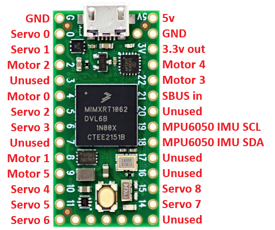
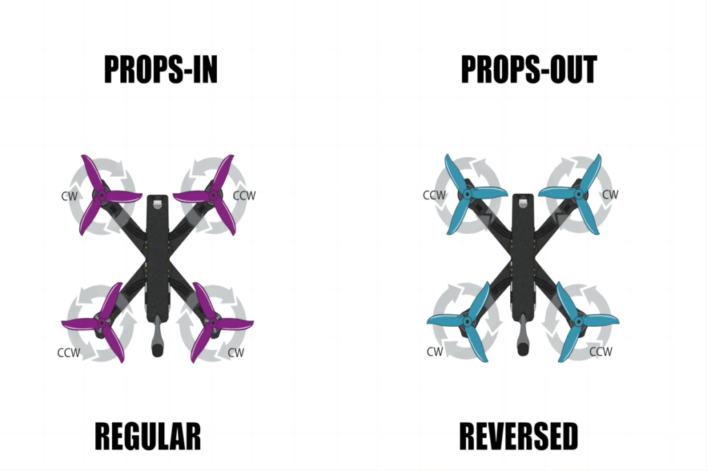

# Motor Setup
## Wiring
All motors should be wired according to the wiring diagram with servo 0 being the first servo.
If you are using the QuickDrehm PCB motors 0-3 will be already wired to the pcb.

In `global_defines.h` `MOTOR_0` to `MOTOR_5` are mapped to match the wiring diagram.

## Important Only Bidirectional Dshot is supported
This means that only ESC that support bidirectional dshot will work. This means that blheli_s ESC can be flashed to the bluejay firmware in order to work.
Newer versions of BL32 will also work.
Fettec, KISS, AM32, and ESCape32 ESC will also all work.

## Finding Which Motor Is Which
Modify the `controlMixer()` function in main.ino so that only one motor at a time will move as you move a throttle.
Example `motor_commands[MOTOR_0] = rc_channels[RC_THROTTLE]`
The `motor_commands` expects a range of 0 to 1, any values outside this ranged are clipped to 0 or 1.
Run this code and ensure that you can spin a motor. The motors will not spin until you arm your aircraft. 
Remember that arming requires throttle low and flicking the arm switch twice.

## Renaming Motors to Match Their Use
In `global_defines.h` the motor defines for the motors you are using should be renamed in all files.
Use Arduino IDE functions to ensure that you have renamed the defines in all files.
Example `MOTOR_0` could be renamed to `MOTOR_FRONT_RIGHT`, `MOTOR_TOP_RIGHT`, `MOTOR_FRONT_LEFT`, or any other name to match its use.
I highly recommend keeping the prefix `MOTOR` in all names to help "namespace" these names and remove any confusion with other similarly named variables or defines.

## Motor Direction
Ensure that motors are spinning in the correct direction for your aircraft.
If the motor is not spinning the correct direction either connect it to the software to reverse it, or swap two motor wires.

