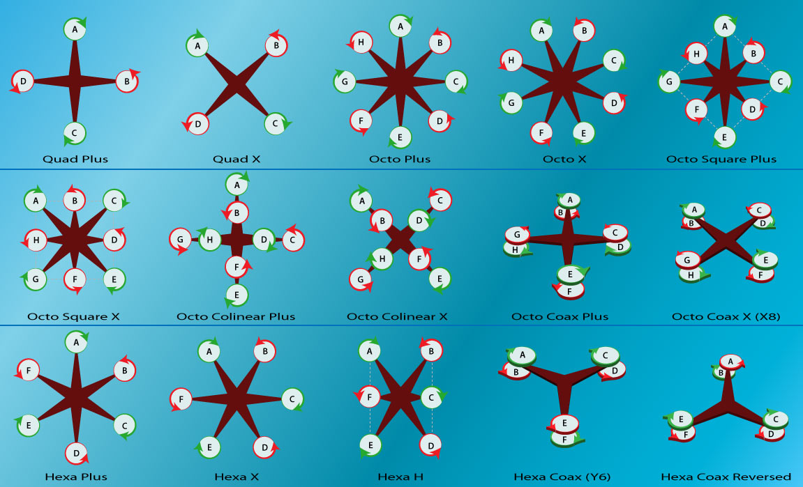
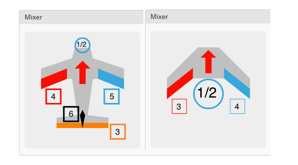
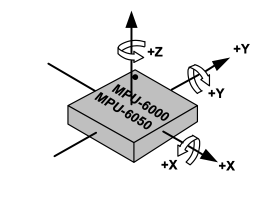

# Output Mixing
Before the output of the PID controller is useful it must be transformed into values for motors and servos.
To do this we use a mixer.

## Control Mixer
The function `controlMixer()` is where the mixing of RC channels and PID sums occurs. This is where the servo and motor commands are updated.

The function `controlMixer()` takes `float rc_channels[], float pidSums[], float motor_commands[], float servo_commands[]` as inputs.

`rc_channels[]` are all the RC channels being sent over your radio. Roll, pitch, and yaw have a range from -1.0 to 1.0. All other channels have a range from 0.0 to 1.0.

`pidSums[]` are the output of the Rate PID Controller. These values are used to mix stabilizing commands to the motors and servos.

`motor_commands[]` are the motor commands. The range is from 0.0 to 1.0. 

`servo_commands[]` are the servo commands. If set up properly the range is your control surface movement angles. 
When setup correctly control surface moving up is positive and down is negative values.

## Mixing It All Together
A positive roll PID sum should create a positive roll rotation.
A positive pitch PID sum should create a positive pitch rotation.
A positive yaw PID sum should create a positive yaw rotation.

Motors create a yaw torque opposite to the direction in which they spin.

Servos can be powered via USB and can be tested without arming the aircraft. 
To test that motors are acting as desired you will need to arm the aircraft and test without propellers!

As an example if we use have a Quad Plus setup shown below a potential mixer would look like:
```
float throttle = rc_channels[RC_THROTTLE];

float pitch_command = pidsum[AXIS_PITCH];
float roll_command = pidsum[AXIS_ROLL];
float yaw_command = pidsum[AXIS_YAW];

motor_commands[MOTOR_A] = throttle - pitch_command - yaw_command;
motor_commands[MOTOR_B] = throttle - roll_command + yaw_command;
motor_commands[MOTOR_C] = throttle + pitch_command - yaw_command;
motor_commands[MOTOR_D] = throttle + roll_command + yaw_command;
```

As an example if we have a wing setup shown below a potential mixer would look like:
```
float throttle = rc_channels[RC_THROTTLE];

float pitch_command = pidsum[AXIS_PITCH];
float roll_command = pidsum[AXIS_ROLL];
float yaw_command = pidsum[AXIS_YAW];

motor_commands[MOTOR_1] = throttle;
servo_commands[MOTOR_3] = pitch_command * 45.0f - roll_command * 45.0f; // the 45.0f relate to the maximum control surface movement
servo_commands[MOTOR_4] = pitch_command * 45.0f + roll_command * 45.0f; // the 45.0f relate to the maximum control surface movement
```






## Positive Rotation Direction Reminder

