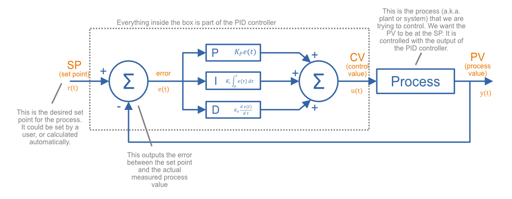
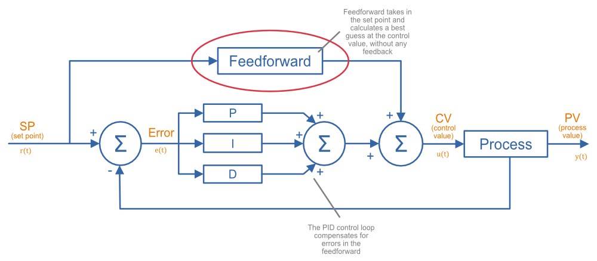

# PID Controller
In this image CV (control value) is the PID sum, and PV (process value) is what I called measurement or the gyro rotation or attitude.
Process is the Mixer that figures out how the motors/servos need to move based on the PID sum.

The controller below is what the Rate PID controller looks like with FeedForward. FeedForward for our use cases is only useful servo movement outputs.
AKA fixed wing or tilt rotor (where the rotors are actively tilting).

## Parts of PID Controller
kp, ki, kp, and kff are just constant scalars for the proportional, integral, derivative, and feedforward.

Error is the difference between the setpoint and the measurement (setpoint - measurement). (Error is already calculated for you in the attitude PID loop)

Measurement will be either the gravity vector (in the attitude PID loop), or the gyro (in the rate PID loop). 
Be sure to remember to use the correct axis when grabbing the setpoint or measurement (AKA gyro[axis]).

Pterm is the error multiplied by kp.

Iterm is the integral of the error multiplied by ki, or in other words the area under the error curve. 
This is done by calculated a new area slice, multiplying it by ki, and adding it to the current integral every loop. 
The width of the new area slice would be DT, or 1.0 / LOOPRATE.

Dterm is the derivative of error, or the negative derivative of measurement multiplied by kd. 
It will be easiest to tune if we use the negative derivative of measurement, but the drones will respond faster if you use the derivative of error. 
The derivative is the current slope of a curve. 
To calculate this we will take the current value and the previous value and find the slope between those two values. 
The slope of two points is simply the difference between the two values divided by the distance between the two points. The distance between the two points would be DT, or 1.0 / LOOPRATE.

Ffterm is the setpoint multiplied by kff.

Pidsum which is the output of the PID controller is simply the pterm, iterm, dterm, and ffterm all added together.

## PID Controller Location
All PID controller code is found in pid.ino

## Attitude PID Controller
The attitude PID controller is actually just a PD controller (there is no need for iterm in the attitude PID controller).
You will need to modify code inside the function `attitudePidApply()` particularly the for loop found on lines 58 to 75 in order to create a PD controller.

The function `attitudePidApply()` takes `attitudePid_t *pid, float setpoint_angles[], float gravity_vector[], float setpoint_rpy[]` as inputs.

`*pid` is a structure that stores all the PID tuning values as well as state required for calculating the derivative.

`setpoint_angles[]` is the current setpoint you are trying to achieve. 

`gravity_vector[]` is the current estimated angle of the aircraft that you want setpoint to reach.

`setpoint_rpy[]` is the PID sum of the attitude PID Controller. This value becomes the setpoint for the Rate PID Controller.

## Rate PID Controller
The rate PID controller is a full FPID controller.
You will need to modify code inside the function `ratePidApply()` particularly the for loop found on lines 200 to 226 in order to create a FPID controller.
The rate controller also includes filtering for the derivative on line 219 that you will not want to modify.

The function `ratePidApply()` takes `ratePid_t *pid, float setpoint[], float gyro[], float pidSums[]` as inputs.

`*pid` is a structure that stores all the PID tuning values as well as state required for calculating the integral and derivative.

`setpoint[]` is the current setpoint you are trying to achieve. 

`gyro[]` is the current gyro reading that you want setpoint to reach.

`pidSums[]` are the output of the PID Controller.

## Helpful Defines
The `#define LOOPRATE` and `#define DT` can be useful for calculating integrals and derivatives.

## PID Tuning Videos

https://www.youtube.com/watch?v=qKy98Cbcltw&ab_channel=Horizon4electronics
https://www.youtube.com/watch?v=fusr9eTceEo&ab_channel=GregoryL.Holst
https://www.youtube.com/watch?v=4Y7zG48uHRo&ab_channel=AerospaceControlsLab
https://www.youtube.com/watch?v=27lMKi2inpk&ab_channel=JoshuaBardwell
https://www.youtube.com/watch?v=d_LuA-SwWQE&ab_channel=JoshuaBardwell
https://www.youtube.com/watch?v=Q9dKVFRsn6k&ab_channel=JoshuaBardwell
https://www.youtube.com/watch?v=5CncRd8O2r4&ab_channel=JoshuaBardwell
https://www.youtube.com/watch?v=ehyXLsvaEhw&ab_channel=StingersSwarm